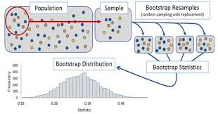

```{r setup, include=FALSE}
knitr::opts_chunk$set(eval=TRUE, include=TRUE, echo=TRUE)
```


```{r}
library(tidyverse)
library(nycflights13)
# The population of ALL 2013 flights from NYC to San Fran International
NY2SF <- flights %>% filter(dest=="SFO" & !is.na(arr_delay))
dim(NY2SF) # ignoring 158 (1.1%) of flights with missing data
```

# Is the following make sensible? Are these statistics?

```{r}
NY2SF %>% summarise(mean_delay=mean(arr_delay),
                    median_delay=median(arr_delay),
                    max_delay=max(arr_delay))
```

```{r}
population_mean <- NY2SF %>% 
  summarize(population_mean_delay=mean(arr_delay))
population_mean<-as.numeric(population_mean)
```

# Is the following make sensible? Are these parameters?

```{r}
# `sample()` is for `vectors` and `slice_sample()` is for `tibbles`
NY2SF_25 <- SF %>% slice_sample(n=25, replace=FALSE)
NY2SF_25 %>% summarise(mean_delay=mean(arr_delay),
                       median_delay=median(arr_delay),
                       max_delay=max(arr_delay))
```
  
```{r}
NY2SF %>% ggplot(aes(x=arr_delay)) + geom_histogram(binwidth=5) + 
  geom_point(aes(x=mean(SF$arr_delay), y=0), color="blue", size=6) + labs(x="Arrival Delays (actual-scheduled) in minutes for all flights", title=paste("Distribution of arrival delays for all flights, \n with population mean of ", round(mean(SF$arr_delay), digits=2), sep="")) + theme(text=element_text(size=18))

set.seed(1234)
d25 <- NY2SF %>% slice_sample(n=25, replace=FALSE) 
d25 %>% ggplot(aes(x=arr_delay)) + geom_histogram(binwidth=5) + geom_point(aes(x=mean(d25$arr_delay), y=0), color="red", size=4) + labs(x="Arrival Delays (actual-scheduled) in minutes for 25 flights", title=paste("Sample of 25 flights, with sample mean of ", mean(d25$arr_delay), sep="")) + xlim(-100, 500) + theme(text=element_text(size=15))

d25 <- NY2SF %>% slice_sample(n=25, replace=FALSE) 
d25 %>% ggplot(aes(x=arr_delay)) + geom_histogram(binwidth=5) + geom_point(aes(x=mean(d25$arr_delay), y=0), color="red", size=4) + labs(x="Arrival Delays (actual-scheduled) in minutes for 25 flights", title=paste("Sample of 25 flights, with sample mean of ", mean(d25$arr_delay), sep="")) + xlim(-100, 500) + theme(text=element_text(size=15))

d25 <- NY2SF %>% sslice_sample(n=25, replace=FALSE) 
d25 %>% ggplot(aes(x=arr_delay)) + geom_histogram(binwidth=5) + geom_point(aes(x=mean(d25$arr_delay), y=0), color="red", size=4) + labs(x="Arrival Delays (actual-scheduled) in minutes for 25 flights", title=paste("Sample of 25 flights, with sample mean of ", mean(d25$arr_delay), sep=""))  + xlim(-100, 500) + theme(text=element_text(size=15))   
```


```{r}
N <- 1000
sample_means <- rep(NA,N)
set.seed(130)
for(i in 1:N){
  NY2SF_25 <- NY2SF %>% slice_sample(n=25, replace=FALSE)
  sample_means[i] <- NY2SF_25 %>% summarize(mean(arr_delay)) %>% as.numeric()
}
sample_means <- tibble(mean_delay=sample_means)

sample_means %>% ggplot(aes(x=mean_delay)) + 
  geom_histogram(binwidth=5,color="black",fill="gray") + 
  labs(x="Means from samples of size 25", 
       title="Sampling distribution for the mean of arr_delay")
```
  
# Describe the sampling distribution of the mean of `arr_delay`.
# What will happen to distribution as we increase (decrease) $n$?


# Reality check: what if we don't have the population?


<!-- https://scholarworks.umass.edu/cgi/viewcontent.cgi?article=1342&context=pare -->


```{r}
observed_data <- NY2SF %>% slice_sample(n=200, replace=FALSE)
obs_mean <- observed_data %>% summarize(mean(arr_delay))
as.numeric(obs_mean) # statistic or parameter?

N <- 1000
boot_means <- rep(NA,N)
set.seed(130)
for(i in 1:N){
  boot_samp <- observed_data %>% slice_sample(n=200, replace=TRUE)
  boot_means[i] <- boot_samp %>% summarize(mean_delay=mean(arr_delay)) %>% as.numeric()
}
boot_means<-tibble(mean_delay=boot_means)
```

# What will the bootstrap sampling distribution be centered around?

```{r}
boot_means %>% 
ggplot(aes(x=mean_delay)) +
  geom_histogram(binwidth=1, fill="tan2", color="black") + 
  labs(x="Means from bootstrap samples", 
       title="Bootstrap sampling distribution for the mean arrival delay")

boot_means %>% summarize(mean_boot_means=mean(mean_delay))
```

```{r}
quantile(boot_means$mean_delay, c(0.25,0.5,0.75))
quantile(boot_means$mean_delay, c(0.025,0.4,0.57))
```

```{r}
boot_means %>% ggplot(aes(x=mean_delay)) +
  geom_histogram(binwidth=1, fill="tan2", color="black") + 
  labs(x="Means from bootstrap samples", 
       title="Bootstrap sampling distribution for the mean arrival delay") + 
  geom_vline(xintercept=quantile(boot_means$mean_delay, 0.025), col="blue") +
  geom_vline(xintercept=quantile(boot_means$mean_delay, 0.975), col="blue")
```

```{r}
quantile(boot_means$mean_delay,c(0.025,0.975))
as.numeric(population_mean)
```

# What if we get a "bad" sample?
# What if we we have a small sample size?
